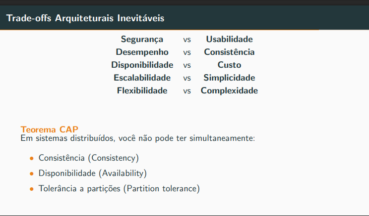

#  Cadastro dos espaços disponiveis

Cadastro dos espaços disponíveis para aluguel, com informações detalhadas como fotos, capacidade e preço

# Gerenciamento das reservas futuras

Gerenciamento das reservas futuras, contemplando data, cliente, espaço alugado e valor pago.

# Controle de pagamentos

Controle de pagamentos, indicando se a reserva possui apenas sinal pago
ou se já está quitada.

## Solução deve corrigir
* double-booking
* perda de informações financeira
* aumento do tempo de operação
* interface complexa

# Modelagem

https://plantuml.com/guide

# (TRÊS ESTADOS DIFERENTES)
* Cada estado tem seu proprios locais?
    * Se sim
        * Nesse caso não seria necessario um bd centralizado de reservas, só para pagamentos e gerenciamento de usuario
    * Se não
        * Precisa aver consistência de dados entre todas as filiais, como resolver double-booking nesse caso?
     
      na descrição: consistência das reservas entre filiais, então não

# ASR's (Architecturally Significant Requirements)

* consistencias entre as filiais
* limitações de usabilidade
* limitações de confiabilidade
* segurança (pagamentos)
* tolerância a falhas
* simples
* intuitiva

Do slide da aula 9
* Segurança (pagamento)
* Confiabilidade (double booking)
* Usabilidade (a veia nao sabe usar)
* Desempenho
* Escalabilidade (escalabilidade elastica em alta temporada?)
* Modificabilidade
* Portabilidade

## Utility Tree

## Listagem das prioridades

### Alta

### Média

### Trade-offs

# Estilo arquitetural
